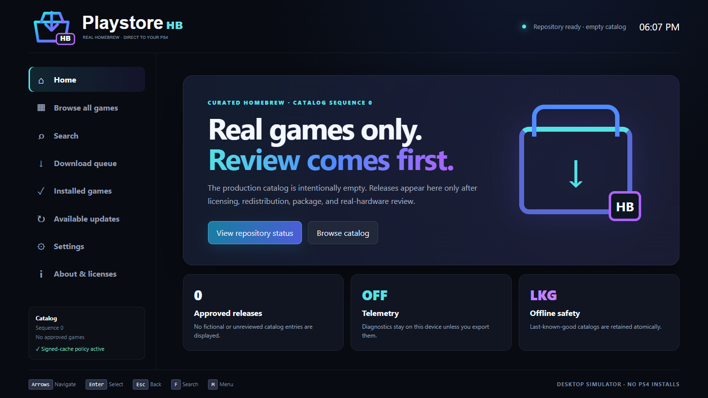

# Playstore HB

**Playstore Homebrew** — *Real homebrew games. Direct to your PS4.*

Playstore HB is a native-homebrew storefront architecture for jailbroken PlayStation 4 systems running authorized homebrew. It browses, verifies, installs, updates, and manages only legally distributable homebrew packages and source-port engines. The production catalog is intentionally empty: no game has yet completed rights and PS4 hardware review.



## What is implemented

- Strict versioned catalog model and JSON Schema; HTTPS, identifiers, filenames, legal records, source-port notices, duplicates, and production fixture checks.
- Canonical JSON, streaming SHA-256, Ed25519 signatures, trusted-key rotation support, expiry/client-version checks, sequence downgrade protection, and atomic last-known-good cache.
- Persistent download queue with `.part` files, range resume, ETag/If-Range, redirect/host limits, TLS-preserving fetch, disk preflight, pause/cancel/retry/reorder/restart recovery, and invalid-file deletion.
- Installed-title/update identity rules and an explicit package-install sequence behind the required platform interfaces.
- Controller-first 1920×1080-safe desktop simulator with all 20 requested screen states, keyboard/gamepad navigation, empty/offline states, settings, focus, original SVG identity, and no invented content.
- Native 1920×1080 OpenOrbis shell with double-buffered video output, controller navigation, safe empty-catalog screens, About disclaimer, original package icon, and compiled AppInstUtil boundary.
- Fastify API, PostgreSQL repository/migration, public catalog routes, role authorization, independent review, audit logging, rate/body limits, MIME/filename validation, idempotency, and transactional publication.
- Admin submission UI, publisher CLI, deterministic media processing, Docker local services, CI, release scripts, policies, and hardware checklist.

## Architecture

`core/` owns reusable catalog, signing, integrity, downloads, persistence, updates, UI navigation, and platform contracts. `apps/desktop-preview` renders the actual simulator; `apps/ps4-client` is the C++17/OpenOrbis boundary; `apps/catalog-api` and `apps/admin-web` implement review/publication; `tools/publisher-cli` is the offline publisher and media tool. See [docs/ARCHITECTURE.md](docs/ARCHITECTURE.md).

## Quick start

Requirements: Node.js 24+, pnpm 11; Docker is optional for PostgreSQL and MinIO.

```powershell
./scripts/bootstrap.ps1
pnpm test
pnpm build
pnpm desktop
```

Linux/macOS equivalents are in `scripts/bootstrap`, `scripts/test`, and `scripts/build-desktop`. `pnpm dev:desktop`, `pnpm dev:api`, and `pnpm dev:admin` run individual services. `docker compose up --build` runs PostgreSQL, MinIO, API, and admin web.

## PS4 build

The PS4 target is pinned to OpenOrbis v0.5.4 and LLVM 18. Set `OO_PS4_TOOLCHAIN` and `LLVM_BIN`, then run `scripts/build-ps4.ps1`. The script directly invokes Clang/LLD, `create-fself`, `create-gp4`, and LibOrbisPkg; OpenOrbis v0.5.4 does not ship the CMake integration assumed by the earlier scaffold. The accepted identifiers are `PSTB00001` and `IV0000-PSTB00001_00-PLAYSTOREHB00000`. See [docs/PS4_BUILD.md](docs/PS4_BUILD.md).

## Publisher examples

```text
pnpm publisher validate content/production/catalog.json
pnpm publisher hash authorized.pkg
pnpm publisher inspect-pkg authorized.pkg
pnpm publisher process-media reviewed-media
pnpm publisher diff-catalog old.json new.json
```

Production signing requires an explicit external key path. No private key is checked in, embedded, or accepted through an example secret.

## Status and limitations

Status: **PS4 build produced but not hardware tested**. Strict TypeScript checks, 43 automated tests, desktop/admin/server builds, an Electron smoke test, OpenOrbis C++ compilation with warnings-as-errors, SELF conversion, fake-PKG construction, LibOrbisPkg validation, and package extraction completed on Windows. No PS4 was available, so installation, launch, rendering, controller behavior, AppInstUtil, networking, suspend/resume, and every other console-only behavior remain unverified. See [docs/HARDWARE_TESTING.md](docs/HARDWARE_TESTING.md), [docs/KNOWN_LIMITATIONS.md](docs/KNOWN_LIMITATIONS.md), and [docs/RELEASE_READINESS.md](docs/RELEASE_READINESS.md).

## Policy and reporting

Read [CONTENT_POLICY.md](CONTENT_POLICY.md) before submitting anything. Security reports follow [SECURITY.md](SECURITY.md). Playstore HB is independent and unaffiliated with Sony Interactive Entertainment, Google, or commercial publishers.
